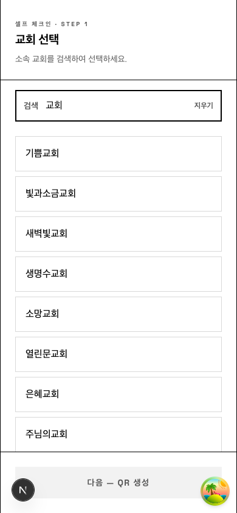
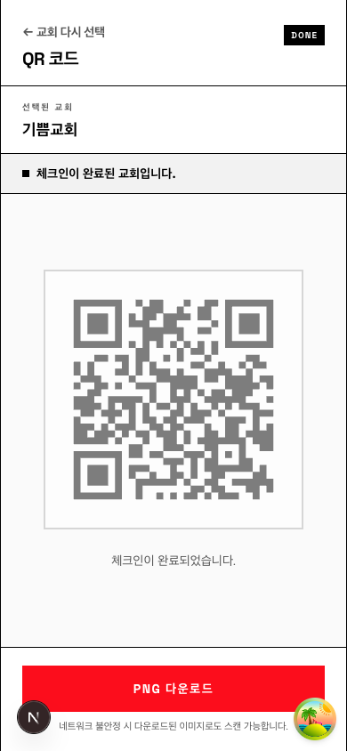
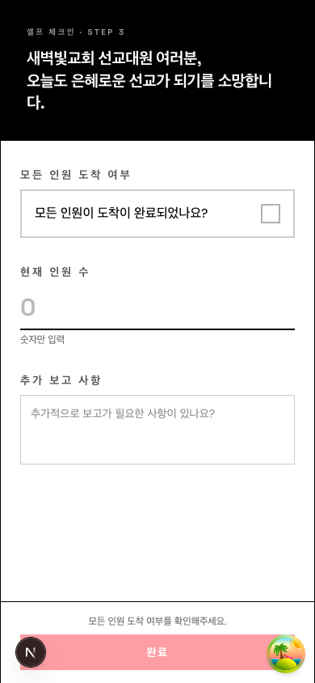
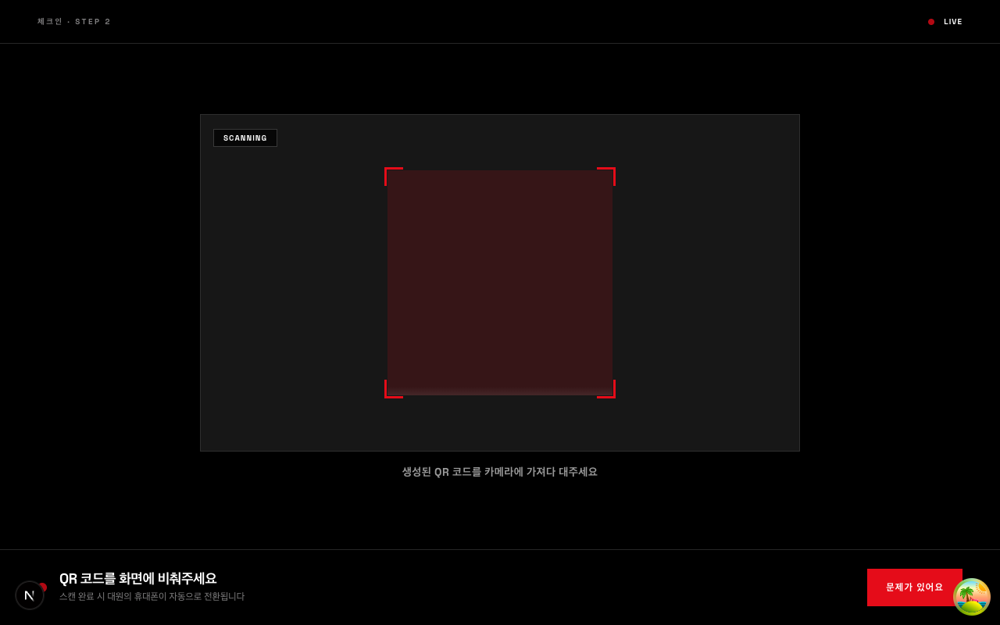
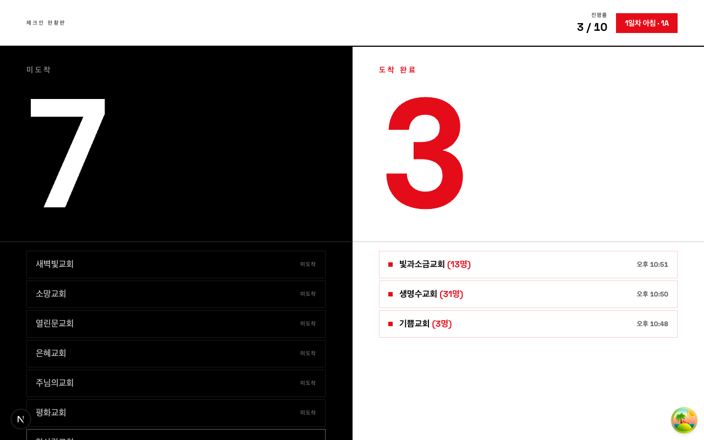
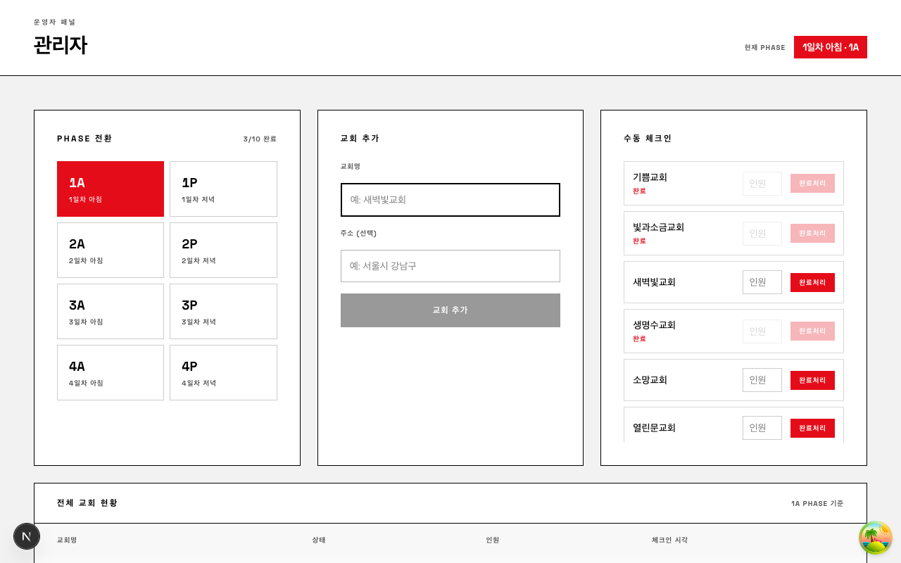

# next-mission-check

선교 대원 QR 셀프 체크인 시스템. 교회별 QR 코드를 스캔하면 체크인 폼으로 자동 이동하고, 관리자 대시보드에 실시간 반영됩니다.

## 기술 스택

- **Framework**: Next.js 16 (App Router)
- **Database**: Neon DB (Serverless Postgres)
- **Realtime**: SSE (Server-Sent Events, Edge Runtime)
- **Data Fetching**: TanStack Query v5
- **Styling**: Tailwind CSS v4

---

## 페이지 구조

| 경로 | 디바이스 | 설명 |
|---|---|---|
| `/generate` | 모바일 | 교회 검색 및 선택 |
| `/generate/[encodedId]` | 모바일 | QR 코드 표시 + PNG 다운로드 |
| `/checkin/[encodedId]` | 모바일 | 셀프 체크인 폼 |
| `/scanner` | PC | 웹캠 QR 스캐너 |
| `/dashboard` | PC | 실시간 체크인 현황판 |
| `/admin` | PC | 관리자 패널 (Phase 전환, 교회 관리) |

> URL의 `[encodedId]`는 `${교회명}:${id}` 를 base64url 인코딩한 값입니다.

---

## 스크린샷

### 모바일 — 교회 선택 / QR 생성 / 체크인 폼

| 교회 검색 | QR 코드 | 체크인 폼 |
|---|---|---|
|  |  |  |

### PC — 스캐너 / 대시보드 / 관리자

| QR 스캐너 | 실시간 대시보드 |
|---|---|
|  |  |

| 관리자 패널 |
|---|
|  |

---

## 체크인 플로우

```
[모바일 대원]   /generate → 교회 검색 및 선택
                              ↓
               /generate/[encodedId] — QR 코드 표시 (SSE 대기)
                              ↓  (PC 운영자가 스캔)
              /scanner — QR 인식 → POST /api/sessions (SCANNED 기록)
                              ↓  (SSE SCANNED 수신)
               /checkin/[encodedId] — 인원 수 + 메모 입력 후 제출
                              ↓  POST /api/checkins
               /generate/[encodedId] — 체크인 완료 (3초 후 자동 이동)

[PC 운영자]    /dashboard — 실시간 체크인 현황 확인 (SSE REFRESH, 1초 폴링)
               /admin     — Phase 전환, 교회 등록/관리
```

---

## URL 인코딩

| 용도 | 형식 | 인코딩 |
|---|---|---|
| 페이지 URL | `/generate/[encodedId]`, `/checkin/[encodedId]` | `base64url("${교회명}:${id}")` |
| QR 코드 값 | 스캐너가 읽는 페이로드 | `base64url(JSON.stringify({ churchId }))` |

---

## Phase 코드

| 코드 | 설명 |
|---|---|
| `1A` | 1일차 아침 |
| `1P` | 1일차 오후 |
| `2A` | 2일차 아침 |
| `2P` | 2일차 오후 |
| … | … |

Phase 코드가 `A`로 끝나면 오전 인삿말, `P`로 끝나면 오후 인삿말이 표시됩니다.

---

## 환경 변수

`.env.local` 파일에 아래 변수를 설정합니다.

```env
DATABASE_URL=               # Neon DB 연결 문자열
NEXT_PUBLIC_BASE_URL=       # 배포 URL (예: https://example.com)
DISCORD_WEBHOOK_URL=        # 스캔 오류 알림용 Discord Webhook (선택)
```

---

## 로컬 실행

```bash
npm install
npm run dev
```

### DB 초기화 (최초 1회)

`src/lib/schema.sql`을 Neon 콘솔에서 실행합니다.

```sql
-- 주소 컬럼 및 중복 교회명 허용 마이그레이션
ALTER TABLE churches ADD COLUMN IF NOT EXISTS address TEXT;
ALTER TABLE churches DROP CONSTRAINT IF EXISTS churches_name_key;
```

```bash
# 시드 데이터 삽입 (교회 목록)
npx tsx --env-file=.env.local src/lib/seed.ts
```

---

## 배포 (Vercel)

1. Vercel에서 GitHub 레포 연결
2. 환경변수 설정: `DATABASE_URL`, `NEXT_PUBLIC_BASE_URL`
3. 배포 완료 후 `NEXT_PUBLIC_BASE_URL`을 실제 도메인으로 업데이트
